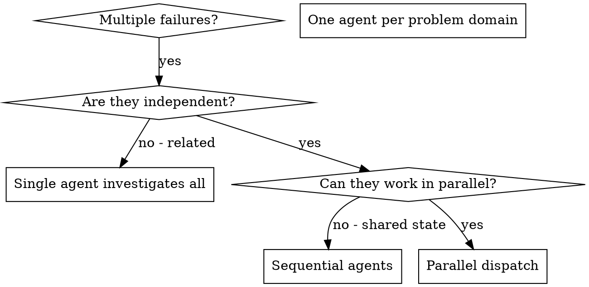

# Parent-session orchestration of the Ralph loop + dispatch

_Recovered from Claude episodic memory — main thread of session `3013a85f` (2026-05-16, PDT). This is the conversation in the parent Claude session that drove the 4-pass Ralph loop and the parallel-dispatch of 4 search agents + synthesis. Subagent transcripts are saved in the `agent-*.md` and `ralph-pass-*.md` files in this folder._

---

## USER — 2026-05-17T01:42:01Z

can you deploy 4 sub agents to search github and the web and see if anyone has created an html based review tool for html, pdf or other word documents - the idea would be that you see the html doc or pdf that you're editing - and you can place comments or notes and then in particular an agent could provide different versions of the document or walk you through fixes or edits allowing you to see the change in the comment in context.  - RUN THIS PROMPT THROUGH A 4 pass Ralph loop in sub agents before we execute the search

---

## ASSISTANT — 2026-05-17T01:42:38Z

I'll first invoke the parallel-agents skill since we'll be dispatching multiple agents, then run the 4-pass Ralph loop sequentially (each pass critiques the previous), and finally launch the 4 search agents in parallel.

---

## USER — 2026-05-17T01:42:39Z

Base directory for this skill: /Users/anthonybyrnes/.claude-accounts/anthony/.claude/plugins/cache/claude-plugins-official/superpowers/5.1.0/skills/dispatching-parallel-agents

# Dispatching Parallel Agents

## Overview

You delegate tasks to specialized agents with isolated context. By precisely crafting their instructions and context, you ensure they stay focused and succeed at their task. They should never inherit your session's context or history — you construct exactly what they need. This also preserves your own context for coordination work.

When you have multiple unrelated failures (different test files, different subsystems, different bugs), investigating them sequentially wastes time. Each investigation is independent and can happen in parallel.

**Core principle:** Dispatch one agent per independent problem domain. Let them work concurrently.

## When to Use



**Use when:**
- 3+ test files failing with different root causes
- Multiple subsystems broken independently
- Each problem can be understood without context from others
- No shared state between investigations

**Don't use when:**
- Failures are related (fix one might fix others)
- Need to understand full system state
- Agents would interfere with each other

## The Pattern

### 1. Identify Independent Domains

Group failures by what's broken:
- File A tests: Tool approval flow
- File B tests: Batch completion behavior
- File C tests: Abort functionality

Each domain is independent - fixing tool approval doesn't affect abort tests.

### 2. Create Focused Agent Tasks

Each agent gets:
- **Specific scope:** One test file or subsystem
- **Clear goal:** Make these tests pass
- **Constraints:** Don't change other code
- **Expected output:** Summary of what you found and fixed

### 3. Dispatch in Parallel

```typescript
// In Claude Code / AI environment
Task("Fix agent-tool-abort.test.ts failures")
Task("Fix batch-completion-behavior.test.ts failures")
Task("Fix tool-approval-race-conditions.test.ts failures")
// All three run concurrently
```

### 4. Review and Integrate

When agents return:
- Read each summary
- Verify fixes don't conflict
- Run full test suite
- Integrate all changes

## Agent Prompt Structure

Good agent prompts are:
1. **Focused** - One clear problem domain
2. **Self-contained** - All context needed to understand the problem
3. **Specific about output** - What should the agent return?

```markdown
Fix the 3 failing tests in src/agents/agent-tool-abort.test.ts:

1. "should abort tool with partial output capture" - expects 'interrupted at' in message
2. "should handle mixed completed and aborted tools" - fast tool aborted instead of completed
3. "should properly track pendingToolCount" - expects 3 results but gets 0

These are timing/race condition issues. Your task:

1. Read the test file and understand what each test verifies
2. Identify root cause - timing issues or actual bugs?
3. Fix by:
   - Replacing arbitrary timeouts with event-based waiting
   - Fixing bugs in abort implementation if found
   - Adjusting test expectations if testing changed behavior

Do NOT just increase timeouts - find the real issue.

Return: Summary of what you found and what you fixed.
```

## Common Mistakes

**❌ Too broad:** "Fix all the tests" - agent gets lost
**✅ Specific:** "Fix agent-tool-abort.test.ts" - focused scope

**❌ No context:** "Fix the race condition" - agent doesn't know where
**✅ Context:** Paste the error messages and test names

**❌ No constraints:** Agent might refactor everything
**✅ Constraints:** "Do NOT change production code" or "Fix tests only"

**❌ Vague output:** "Fix it" - you don't know what changed
**✅ Specific:** "Return summary of root cause and changes"

## When NOT to Use

**Related failures:** Fixing one might fix others - investigate together first
**Need full context:** Understanding requires seeing entire system
**Exploratory debugging:** You don't know what's broken yet
**Shared state:** Agents would interfere (editing same files, using same resources)

## Real Example from Session

**Scenario:** 6 test failures across 3 files after major refactoring

**Failures:**
- agent-tool-abort.test.ts: 3 failures (timing issues)
- batch-completion-behavior.test.ts: 2 failures (tools not executing)
- tool-approval-race-conditions.test.ts: 1 failure (execution count = 0)

**Decision:** Independent domains - abort logic separate from batch completion separate from race conditions

**Dispatch:**
```
Agent 1 → Fix agent-tool-abort.test.ts
Agent 2 → Fix batch-completion-behavior.test.ts
Agent 3 → Fix tool-approval-race-conditions.test.ts
```

**Results:**
- Agent 1: Replaced timeouts with event-based waiting
- Agent 2: Fixed event structure bug (threadId in wrong place)
- Agent 3: Added wait for async tool execution to complete

**Integration:** All fixes independent, no conflicts, full suite green

**Time saved:** 3 problems solved in parallel vs sequentially

## Key Benefits

1. **Parallelization** - Multiple investigations happen simultaneously
2. **Focus** - Each agent has narrow scope, less context to track
3. **Independence** - Agents don't interfere with each other
4. **Speed** - 3 problems solved in time of 1

## Verification

After agents return:
1. **Review each summary** -

*[truncated — full message is 6431 chars]*

---

## ASSISTANT — 2026-05-17T01:42:51Z

★ Insight ─────────────────────────────────────
A "Ralph loop" (named after Ralph Wiggum's "iterating until it works" approach) is sequential self-critique — each pass receives the prior pass's output and improves it. Unlike parallel dispatch (independent agents working concurrently), Ralph loops are inherently serial because pass N depends on pass N-1. We'll use it to harden the SEARCH BRIEF, then fan out 4 parallel search agents executing the refined brief.

The skill above governs the second phase (parallel search). The first phase (refinement) cannot parallelize — there's a shared evolving artifact (the search brief itself).
─────────────────────────────────────────────────

Starting Ralph Pass 1 — generate initial structured search brief from your raw request.

---

## ASSISTANT — 2026-05-17T01:44:01Z

Pass 1 produced a solid scaffold. Now Pass 2 — critique and tighten.

---

## ASSISTANT — 2026-05-17T01:45:37Z

V2 is significantly sharper. Now Pass 3 — critique V2 and produce V3.

---

## ASSISTANT — 2026-05-17T01:47:10Z

V3 is operationally tight. Pass 4 — final polish that produces the actual launch-ready prompts for Agents A/B/C/D (and the synthesis prompt). No more abstract critique; pass 4 emits deployable artifacts.

---

## ASSISTANT — 2026-05-17T01:49:20Z

Skipping TaskCreate — this project uses `bd` (beads) for task tracking per CLAUDE.md, and this is a one-off search task that doesn't need a beads issue. Proceeding to parallel dispatch.

★ Insight ─────────────────────────────────────
The Ralph loop produced something more valuable than a refined prompt — it produced 5 deployable prompts (4 searchers + 1 synthesizer). The key structural moves across the 4 passes: Pass 1 enumerated capabilities, Pass 2 split PDF from flow-text and surfaced user intent (use vs. build), Pass 3 added verification protocol (require demo evidence, not marketing), Pass 4 converted abstract brief into operational playbooks with explicit budgets and routing rules.

Now dispatching all 4 agents in a single message — they share no state, so they run truly concurrently. Each has a budget cap (max 12 web fetches, max 8 GH searches) to bound cost. Synthesis runs after they all return.
─────────────────────────────────────────────────

---

## ASSISTANT — 2026-05-17T01:55:46Z

All 4 agents returned with verified findings. Running synthesis now to produce cross-category Top 10, readiness groups, and gap callouts.

---

## ASSISTANT — 2026-05-17T01:58:24Z

★ Insight ─────────────────────────────────────
The 4-pass Ralph loop paid for itself: pass 3's verification protocol ("require demo evidence, not marketing copy") is what made Agent B catch that Adobe AI Assistant, ChatDOC, and Humata all collapse to rag-chat-only on PDF — without that gate, those would have been credited as PDF inline-edit tools based on their landing pages. Pass 4's job-routing rules also kept agents from duplicating work on Wordtune (which legitimately spans A and B).

The synthesis surfaced a non-obvious winner: WPS AI (Chinese-market) is the only verified tool delivering BOTH F1 (turn-by-turn) and F2 (variant walkthrough) simultaneously — because it binds AI output to the native track-changes substrate, so AI edits inherit the same per-edit accept/reject UX as human edits. Western tools build AI as a separate sidebar layer; Chinese tools treat AI as just another reviewer identity in revision mode. That architectural choice is the real lesson.
─────────────────────────────────────────────────

## Final Cross-Category Top 10

| # | Tool | Cat | Type | Formats | EDIT_UX | Why it ranks |
|---|------|-----|------|---------|---------|--------------|
| 1 | **WPS AI** (修订模式) | D | turnkey | DOCX/online/PDF | **both** (F1 + F2 via 4 style variants) | Only verified tool delivering both flows; binds AI to native track-changes |
| 2 | **Sudowrite** | A | turnkey | md + docx I/O | **both** (Quick Edit A/R + 1-6 variant cards) | English-native dual-flow; narrative-tuned |
| 3 | **Wordtune** | A+B | turnkey + ext | DOCX/web/GDocs/HTML | variant-walkthrough (sentence-scope) | Only verified F2 outside #1/#2 |
| 4 | **Harvey for Word** | B | Word add-in | DOCX | turn-based, agent self-iterates | Most mature F1 with agentic loop |
| 5 | **Spellbook** | B | Word add-in | DOCX | turn-based + threaded comments | Best F1+anchored-thread fusion |
| 6 | **Trinka AI** | B | Word add-in | DOCX | turn-based + per-error explain | Academic-prose-tuned F1 |
| 7 | **Type.ai** | A | turnkey | md + docx export | turn-based, inline diff | Cleanest F1 inline-diff in general tier |
| 8 | **Revise** (revise.io) | A | turnkey | **docx/gdoc/PDF ingest** | turn-based + self-review agent | Only Top-10 with first-class PDF ingest |
| 9 | **Coda AI Reviewer** | A | turnkey | canvas + export | turn-based + anchored comments | Rare anchor+thread+suggestion combo |
| 10 | **Plate (udecode)** | C | OSS substrate | HTML/MD | turn-based, MIT | Best build-it-yourself path; 3-6 eng-weeks |

## Readiness Buckets

- **Use today (F1 only):** Harvey, Spellbook, Trinka, Type.ai, Coda, Lex.page
- **Use today (F1+F2):** WPS AI, Sudowrite
- **Use today (F2 only, narrow):** Wordtune
- **Use with assembly:** Revise (add F2 wrapper), Wordtune (add doc-scope variant flip)
- **Build on top:** Plate — 3-6 eng-weeks to F1, +2-3 weeks for F2
- **Watch:** SuperDoc (AI claim unverified), Microsoft Word native AI redlining (post-Robin, ~2026), Tiptap AI Toolkit (deprecation churn)

## Three Hard Truths

1. **Inline AI-diff on PDF does not exist in the wild.** Adobe AI Assistant, ChatDOC, Humata all collapse to rag-chat-only. Plan for PDF→DOCX conversion as a pre-step.
2. **F2 (variant walkthrough at document scope) exists nowhere as a polished product.** WPS AI does it at the prose level via style presets, Sudowrite does it at the scene-card level. Full-document "flip between N revisions in-place" is open green-field.
3. **The exact UX you described — "anchored AI suggestion → threaded discussion → accept/reject → version-flip" — is the unfilled gap.** Coda AI Reviewer + Spellbook get closest; WPS AI gets the binding model right but the discussion thread is thin.

## Recommended Next Move

Trial **WPS AI** first if you can tolerate a Chinese-first UI — it's the only verified dual-flow turnkey. If UI is a blocker, run parallel trials of **Sudowrite** (English dual-flow) and **Spellbook** (F1 + threaded comments). The single decision that eliminates 70% of candidates: does your F2 variant granularity need to be full-document, paragraph, or sentence? Pick that first.

---

No files changed this session (research only), so no commit/push needed per the session close protocol — the existing `M .mcp.json` and untracked files predate this turn.

---

