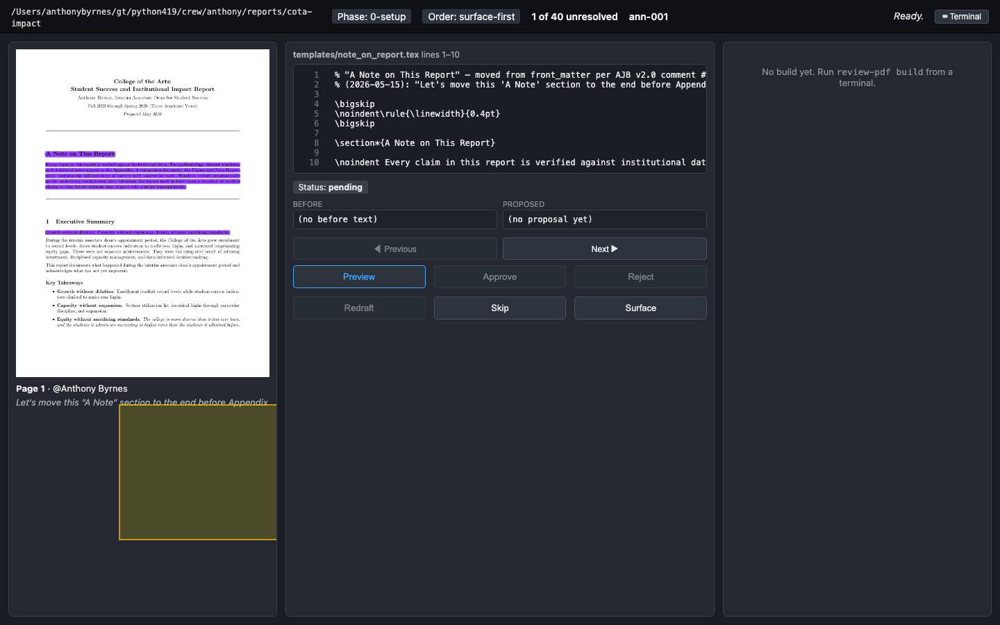
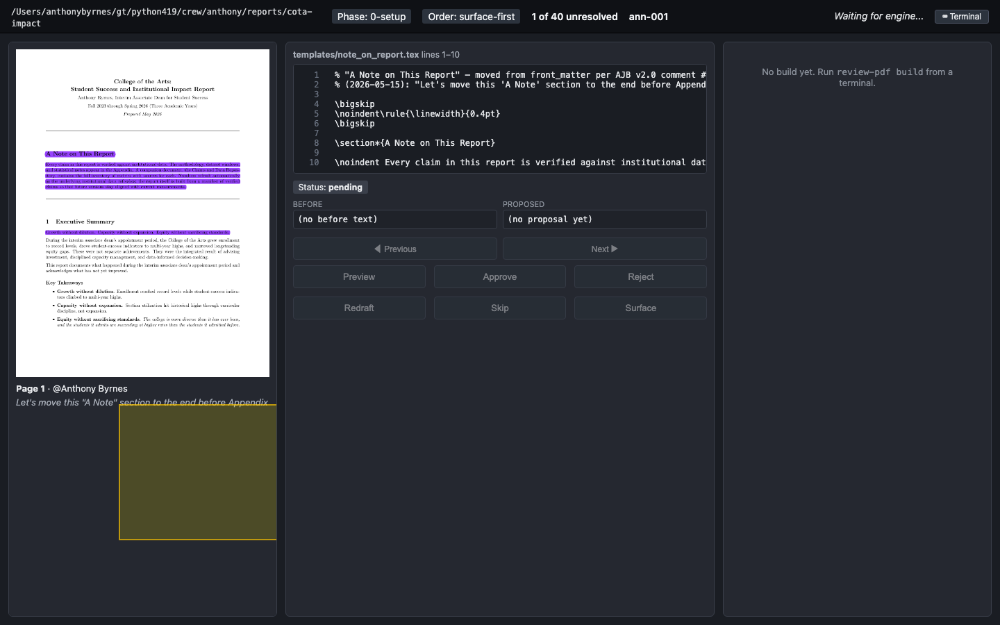
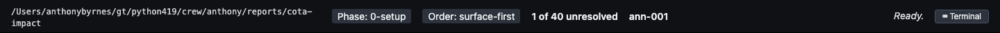
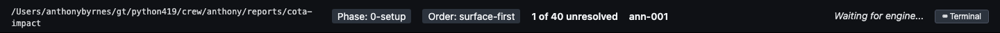
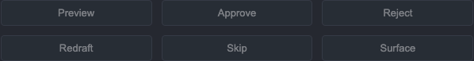

# Ready-bugs UX screenshots — 2026-05-17

Live captures of the viewer (and CLI, where relevant) for the three currently-ready bugs. Source project: `~/gt/python419/crew/anthony/reports/cota-impact/` — the COTA Impact Report project python419 used for the v1 verification run.

Server: `review-pdf serve --order surface-first --port 8765` against that project.
State at capture time: `40 total · 31 pending · 9 surfaced_pending · current_annotation_id: None · order: surface-first`.

---

## rev-3pm (P0) — viewer buttons silently no-op when no consumer attached

Click any state-mutating button (Skip / Surface / Approve / Reject / Redraft / Preview), no Claude `wait-event` consumer running. The event is appended to `state-events.jsonl`; nothing in `state.json` changes. The viewer flips the top-right status from **Ready** → **Waiting for engine…** and stays there.

| | |
|---|---|
|  |  |
| Full viewer, fresh load. Status = **Ready.** | After clicking **Skip**. `ann-001`, "1 of 40 unresolved", and Status: pending all unchanged. |

Topbar zooms — the only visible difference:

| | |
|---|---|
|  |  |
| Status: **Ready.** | Status: **Waiting for engine…** (indefinite — no toast, no timeout, no recovery path) |

Button row that triggers this:



**Confirmed silent no-op** by inspecting state after the click: `current_annotation_id` still `None`, status counts unchanged. Events logged in `.review-state/state-events.jsonl`:

```
{"ts":"2026-05-18T02:28:55Z","annotation_id":"ann-001","action":"skip"}
{"ts":"2026-05-18T02:28:59Z","annotation_id":"ann-001","action":"navigate","direction":"next"}
```

---

## rev-cav (P2) — `--order surface-first` doesn't reorder the viewer entry point

`serve --order surface-first` against a project with 9 `surfaced_pending` annotations. The viewer should open to the first `surfaced_pending` (e.g. `ann-006`) but opens to `ann-001` (status: pending).


Header is the load-bearing evidence: **Order: surface-first** alongside **ann-001** with **Status: pending**. `state.json` confirms `order: "surface-first"` and `current_annotation_id: null`.


---

## rev-2mq (P3) — extract summary counts diverge from state.json

CLI bug, not viewer — no screenshot possible. Captured stdout from `review-pdf status` against the same project state, for the post-bulk-surface side of the comparison:

`screenshots/rev-2mq-status-output.txt`:
```
Phase: 0-setup (order: surface-first) · current: (none)
Counts: 40 total · 31 pending · 9 surfaced_pending
Last build: (none)
Working tree: dirty (13 files)
```

The original bug report (msg `hq-wisp-pp0lbh`, AJB run on the RESTORED PDF) showed:
- `extract` summary line: `'extracted 40 annotation(s); 1 needs_review, 8 surfaced_pending'`
- `status` against same `.review-state/`: `'Counts: 40 total · 39 pending · 1 surfaced_pending'`

I did not re-extract from the source PDF (the RESTORED PDF wasn't readily locatable on disk), so the live status snapshot above is post-`bulk-surface` state, not the fresh-extract state the bug describes. Re-run `review-pdf extract` on a fresh `.review-state/` to reproduce the count divergence.

---

## How these were captured

1. `review-pdf serve --project-dir ~/gt/python419/crew/anthony/reports/cota-impact --port 8765 --order surface-first`
2. Playwright (Python, `uv run --with playwright`) at viewport 1440×900, full-page screenshots.
3. Capture script preserved at `/tmp/rev-screenshots/capture.py` and `capture_crops.py` — not committed (transient).

## Caveats

- The two "after click" full-page shots (`rev-3pm-2`, `rev-3pm-3`) look visually identical to the "before" shot **except** for the top-right "Waiting for engine…" indicator. That is the bug.
- All captures are against a single, mutated project state. A fresh re-extract is needed to reproduce rev-2mq end-to-end.
